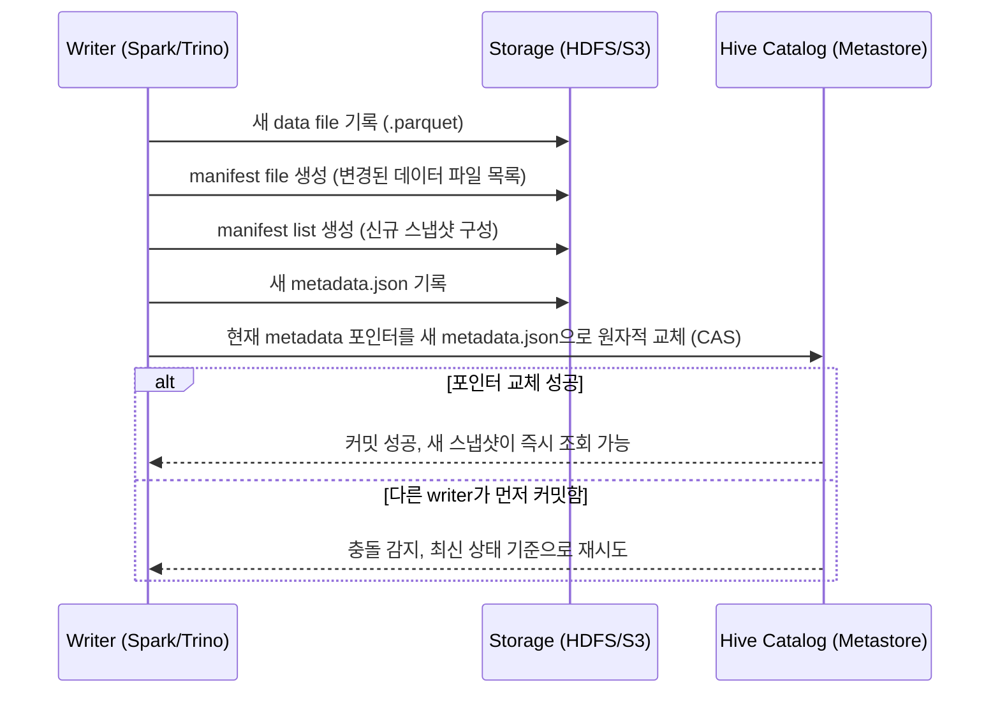

> 사내에서 사용 중인 Hive 환경에, 요즘 핫하다는 오픈 테이블 포맷인 Apache Iceberg를 도입해볼까 고민이 되어 사전에 정리해본 글입니다. Hive 테이블과 Iceberg 테이블은 애초에 별개의 테이블 포맷이고, 실제로 검토하는 방향은 **지금 쓰고 있는 Hive Metastore를 Iceberg의 카탈로그로 재사용해서 Iceberg 테이블을 만들고 조회하는 것**이다.

### <i class="fas fa-triangle-exclamation fa-fw"></i> **기존 Hive 테이블의 한계**

Hive 테이블(특히 파티션 테이블)을 오래 운영하다 보면 반복적으로 부딪히는 문제들이 있다.

- **파티션을 물리적 경로로 관리** : 파티션 정보가 HDFS 디렉토리 구조 자체와 결합돼 있어서, 외부에서 파일을 직접 올려두면 `MSCK REPAIR TABLE`을 돌려야 메타스토어가 인식한다.
- **파티션 컬럼이 쿼리에 그대로 노출** : `WHERE basDt = '20260816'`처럼 사용자가 파티션 컬럼을 정확히 알고 써야 파티션 프루닝이 동작한다.
- **스키마 변경이 위험함** : 컬럼 순서/타입을 바꾸면 이미 쌓인 파일과의 정합성이 깨지기 쉽다.
- **원자적 커밋이 없음** : 같은 테이블에 여러 잡이 동시에 쓰기 작업을 하면 일관성이 보장되지 않는다.

### <i class="fas fa-layer-group fa-fw"></i> **오픈 테이블 포맷이 등장한 이유**

Iceberg, Delta Lake, Hudi 같은 오픈 테이블 포맷들은 공통적으로 같은 목표를 갖는다. **파일 위에 메타데이터 레이어를 얹어서, 파일 저장소를 진짜 "테이블"처럼 다룰 수 있게 만드는 것**이다. 스냅샷 단위로 변경 이력을 관리하기 때문에 원자적 커밋, 스키마 진화, 타임 트래블 같은 기능이 자연스럽게 따라온다. Iceberg는 이 중에서도 Netflix가 자체적으로 겪은 페타바이트급 Hive 테이블 운영 문제(느린 파티션 나열, 잦은 메타데이터 충돌)를 해결하려고 만든 뒤 Apache 프로젝트로 공개한 것이 시작이었고, 이후 Snowflake·AWS·Databricks·Google BigQuery 같은 주요 벤더들이 잇따라 네이티브 지원을 발표하면서 사실상 업계 표준으로 자리 잡았다.

왜 하필 Iceberg가 "차세대 테이블 포맷"으로 불리게 됐는지는 아래 영상에서 배경을 잘 짚어준다.



### <i class="fas fa-cube fa-fw"></i> **Apache Iceberg 핵심 개념**

Iceberg 테이블은 메타데이터가 계층적으로 구성돼 있다.

```
metadata.json (테이블 전체 스냅샷 이력)
   └── manifest list (특정 스냅샷에 속한 manifest 목록)
         └── manifest file (실제 데이터 파일들의 경로·통계 정보)
               └── data file (parquet/orc/avro 등 실제 데이터)
```

{: width="900" height="520" }
_Apache Iceberg 메타데이터 계층 구조_

"원자적 커밋"이 실제로 어떻게 이뤄지는지는, 커밋 시점에 무슨 일이 일어나는지를 시간순으로 보면 이해가 빠르다.



핵심은 실제 데이터 파일은 미리 다 써두고, **카탈로그의 metadata 포인터 하나만 원자적으로 교체**한다는 점이다. 이 포인터 교체가 성공하는 순간 새 스냅샷이 통째로 반영되고, 그 전까지는 기존 스냅샷을 읽는 쪽에 아무 영향도 없다. 동시에 여러 writer가 커밋을 시도하면 포인터를 먼저 교체한 쪽만 성공하고, 나머지는 최신 상태를 기준으로 재시도하는 낙관적 동시성 제어(optimistic concurrency) 방식이다.

이 구조 덕분에 아래 기능들이 가능해진다.

- **Hidden Partitioning** : 파티션 컬럼을 쿼리에서 몰라도 된다. 예를 들어 `basDt`를 `day(basDt)`로 파티셔닝해두면, 사용자는 그냥 `basDt`로 필터링해도 Iceberg가 알아서 파티션을 프루닝한다.
- **Schema Evolution** : 컬럼 추가/삭제/이름 변경/타입 확장이 기존 데이터 파일의 재작성 없이 메타데이터 수준에서 처리된다.
- **Time Travel / Rollback** : 스냅샷 ID나 타임스탬프 기준으로 과거 시점의 테이블 상태를 그대로 조회하거나 롤백할 수 있다.

이 세 가지(히든 파티셔닝, 스키마 진화, 타임 트래블)를 실제 동작 예시와 함께 더 깊게 다루는 영상도 참고할 만하다.



### <i class="fas fa-book fa-fw"></i> **카탈로그(Catalog)는 무엇을 하는가**

앞선 시퀀스 다이어그램에서 "카탈로그"가 하는 일은 딱 하나, **현재 metadata.json이 어디 있는지 가리키는 포인터를 원자적으로 관리하는 것**이다. 이 역할을 누가 맡느냐에 따라 카탈로그 종류가 나뉘는데, Iceberg는 카탈로그 구현체를 특정하지 않고 여러 선택지를 열어둔다.

| 카탈로그 | 특징 | 적합한 상황 |
|---|---|---|
| **Hive Catalog** | 기존 Hive Metastore(HMS)를 그대로 재사용 | 이미 HMS를 운영 중인 온프레미스 Hadoop 환경 |
| **AWS Glue Catalog** | AWS 관리형 서비스, S3/Athena/EMR과 자연스럽게 통합 | AWS 기반 데이터 플랫폼 |
| **REST Catalog** | Iceberg 스펙에 정의된 표준 REST API. 엔진에 종속되지 않음 | 여러 엔진(Spark, Trino, Flink 등)이 하나의 카탈로그를 공유해야 할 때 |
| **JDBC Catalog** | Postgres 등 RDBMS를 카탈로그 저장소로 사용 | 별도 인프라 없이 기존 DB로 가볍게 시작하고 싶을 때 |
| **Nessie** | Git처럼 브랜치/태그/커밋 개념으로 데이터 버전 관리 | 여러 테이블을 하나의 트랜잭션으로 묶어야 하는 경우 |

지금 검토하는 방향은 이 중 **Hive Catalog**다. 새 인프라를 따로 두지 않고, 지금 운영 중인 HMS를 그대로 Iceberg 카탈로그로 쓰겠다는 것이 이번 검토의 핵심 전제였다.

### <i class="fas fa-plug fa-fw"></i> **Hive Metastore와의 연동**

기존 인프라를 갈아엎지 않아도 되는 게 Iceberg를 검토한 가장 큰 이유였다. Iceberg의 **Hive Catalog**를 쓰면 지금 쓰고 있는 HMS를 카탈로그로 그대로 재사용할 수 있고, Hive 3.x부터는 StorageHandler를 통해 Hive 세션에서 곧바로 Iceberg 테이블을 읽고 쓸 수 있다.

```sql
CREATE TABLE etf_price_info_iceberg (
  basDt   STRING,
  isinCd  STRING,
  itmsNm  STRING,
  clpr    STRING,
  fltRt   STRING
)
PARTITIONED BY (days(basDt))
STORED BY 'org.apache.iceberg.mr.hive.HiveIcebergStorageHandler'
TBLPROPERTIES (
  'iceberg.catalog' = 'hive_catalog'
);
```

`PARTITIONED BY (days(basDt))`처럼 파티션 변환 함수를 직접 선언한다는 점이 기존 Hive의 `PARTITIONED BY (basDt STRING)` 방식과 가장 눈에 띄는 차이다. 다만 여기서 HMS는 어디까지나 "metadata.json 포인터를 담아두는 카탈로그" 역할일 뿐, 실제 데이터가 어떻게 저장되고 읽히는지에 대한 로직은 전부 Iceberg 라이브러리(및 StorageHandler) 쪽에 있다는 점을 분명히 해두는 게 좋다. 기존 Hive 테이블의 메타스토어 스키마와 Iceberg 테이블의 메타스토어 스키마는 내부적으로 다르게 취급된다.

### <i class="fas fa-code-branch fa-fw"></i> **파티션도 진화한다 — Partition Evolution**

Hidden Partitioning 못지않게 실무에서 매력적인 기능이 파티션 스펙 자체를 바꿀 수 있다는 점이다. 기존 Hive 테이블은 파티션 컬럼을 한 번 정하면 사실상 테이블을 새로 만들지 않는 이상 바꾸기 어렵다. Iceberg는 파티션 스펙 변경을 메타데이터 갱신으로 처리한다.

```sql
-- 지금까지는 일(day) 단위로 파티셔닝했지만, 데이터가 늘어나서 월(month) 단위로 바꾸고 싶은 경우
ALTER TABLE etf_price_info_iceberg
REPLACE PARTITION FIELD days(basDt) WITH months(basDt);
```

이 명령을 실행해도 **기존에 쌓여있던 데이터 파일은 그대로 둔다.** 새 파티션 스펙은 이 시점 이후에 들어오는 데이터부터 적용되고, Iceberg는 스냅샷마다 어떤 파티션 스펙이 쓰였는지 기억하고 있어서 과거 스펙으로 쓰인 파일과 새 스펙으로 쓰인 파일이 섞여 있어도 쿼리 결과는 정확하게 나온다. 파티션 정책을 나중에 재설계해야 할 일이 잦은 팀이라면 이 부분만으로도 도입 이유가 될 만하다.

### <i class="fas fa-eraser fa-fw"></i> **삭제·수정은 어떻게 처리될까 — Copy-on-Write vs Merge-on-Read**

`UPDATE`/`DELETE`/`MERGE`처럼 이미 쓰인 행을 건드리는 작업은 Iceberg 포맷 v2부터 두 가지 전략 중 하나로 처리된다.

| 구분 | Copy-on-Write (COW) | Merge-on-Read (MOR) |
|---|---|---|
| 동작 방식 | 영향받는 data file을 통째로 다시 써서 새 파일로 교체 | 원본 data file은 그대로 두고, 어떤 행이 삭제/변경됐는지 표시하는 **delete file**만 추가로 기록 |
| 쓰기 비용 | 높음 (파일 전체 재작성) | 낮음 (변경분만 기록) |
| 읽기 비용 | 낮음 (바로 최신 상태) | 상대적으로 높음 (읽을 때 data file + delete file을 병합) |
| 적합한 워크로드 | 배치성 작업, 쓰기 빈도가 낮고 읽기가 훨씬 잦은 테이블 | 실시간/준실시간 upsert처럼 쓰기가 잦은 테이블 |

delete file도 두 방식으로 나뉜다. **position delete**는 "어느 파일의 몇 번째 행을 지웠다"는 위치 정보를 기록하는 방식이라 읽을 때 병합이 빠르고, **equality delete**는 "`order_id = 1234`인 행을 지웠다"처럼 조건값 자체를 기록하는 방식이라 쓰기는 가볍지만 읽을 때 조건 매칭 비용이 더 든다. Iceberg는 테이블 단위 또는 작업(delete/update/merge) 단위로 이 전략을 다르게 지정할 수 있어서, 읽기 위주 테이블은 COW로 두고 잦은 업데이트가 필요한 테이블만 MOR로 두는 식의 혼용도 가능하다.

### <i class="fas fa-code-compare fa-fw"></i> **기존 Hive 테이블과 체감 차이**

- 외부에서 새 파일이 들어와도 `MSCK REPAIR TABLE`을 돌릴 필요가 없다. `INSERT`나 Spark/Trino의 write API를 통해 커밋하면 메타데이터가 즉시 갱신된다.
- 컬럼 추가 같은 스키마 변경이 서비스 중단 없이 바로 반영된다.
- 대신 관리 포인트가 아예 없어지는 건 아니고, 성격이 바뀐다. Iceberg는 아래와 같은 유지보수용 프로시저를 제공하는데 이걸 주기적으로 돌려주는 운영이 필요하다.
  - `rewrite_data_files` : MOR로 쌓인 작은 delete file이나 작은 data file들을 압축(compaction)
  - `expire_snapshots` : 오래된 스냅샷 이력을 정리해서 메타데이터·스토리지 용량 회수
  - `remove_orphan_files` : 커밋 실패 등으로 메타데이터에서 참조되지 않는 고아 파일 삭제

```sql
-- Spark SQL 기준 예시
CALL hive_catalog.system.rewrite_data_files(table => 'db.etf_price_info_iceberg');
CALL hive_catalog.system.expire_snapshots(table => 'db.etf_price_info_iceberg', older_than => TIMESTAMP '2026-08-01 00:00:00');
```

### <i class="fas fa-flag-checkered fa-fw"></i> **정리 및 고려사항**

당장 전체 테이블을 Iceberg로 마이그레이션하기보다는, 스키마 변경이 잦거나 동시 쓰기가 많은 테이블 한두 개부터 시범 도입해보는 게 안전할 것 같다. Presto/Trino 같은 엔진과의 호환성도 이미 준수한 편이라, Hive로 적재하고 Presto로 조회하는 지금 구조를 크게 바꾸지 않고도 얹을 수 있다는 점이 특히 매력적이다. 다만 COW/MOR 전략 선택이나 컴팩션·스냅샷 만료 같은 유지보수 작업은 기존 Hive 테이블에는 없던 새로운 운영 부담이라, 도입 전에 누가 이 배치를 스케줄링하고 모니터링할지도 같이 정해두는 게 좋을 것 같다. 다음 글에서는 실제로 팀 테이블 하나를 Iceberg로 전환해본 과정과 컴팩션 운영기를 다뤄볼 예정이다.
