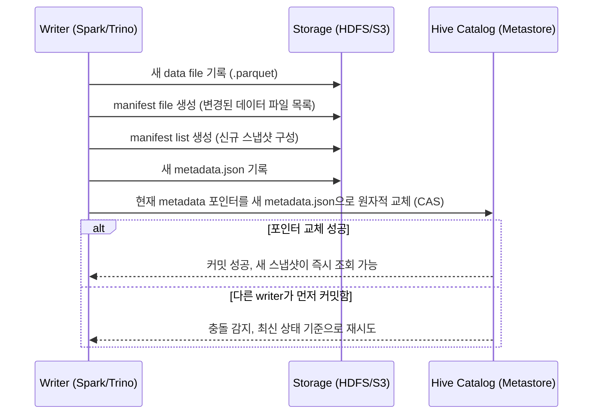

> 사내에서 사용 중인 Hive 환경에, 요즘 핫하다는 오픈 테이블 포맷인 Apache Iceberg를 도입해볼까 고민이 되어 사전에 정리해본 글입니다.

### <i class="fas fa-triangle-exclamation fa-fw"></i> **기존 Hive 테이블의 한계**

Hive 테이블(특히 파티션 테이블)을 오래 운영하다 보면 반복적으로 부딪히는 문제들이 있다.

- **파티션을 물리적 경로로 관리** : 파티션 정보가 HDFS 디렉토리 구조 자체와 결합돼 있어서, 외부에서 파일을 직접 올려두면 `MSCK REPAIR TABLE`을 돌려야 메타스토어가 인식한다.
- **파티션 컬럼이 쿼리에 그대로 노출** : `WHERE basDt = '20260816'`처럼 사용자가 파티션 컬럼을 정확히 알고 써야 파티션 프루닝이 동작한다.
- **스키마 변경이 위험함** : 컬럼 순서/타입을 바꾸면 이미 쌓인 파일과의 정합성이 깨지기 쉽다.
- **원자적 커밋이 없음** : 같은 테이블에 여러 잡이 동시에 쓰기 작업을 하면 일관성이 보장되지 않는다.

### <i class="fas fa-layer-group fa-fw"></i> **오픈 테이블 포맷이 등장한 이유**

Iceberg, Delta Lake, Hudi 같은 오픈 테이블 포맷들은 공통적으로 같은 목표를 갖는다. **파일 위에 메타데이터 레이어를 얹어서, 파일 저장소를 진짜 "테이블"처럼 다룰 수 있게 만드는 것**이다. 스냅샷 단위로 변경 이력을 관리하기 때문에 원자적 커밋, 스키마 진화, 타임 트래블 같은 기능이 자연스럽게 따라온다.

### <i class="fas fa-cube fa-fw"></i> **Apache Iceberg 핵심 개념**

Iceberg 테이블은 메타데이터가 계층적으로 구성돼 있다.

```
metadata.json (테이블 전체 스냅샷 이력)
   └── manifest list (특정 스냅샷에 속한 manifest 목록)
         └── manifest file (실제 데이터 파일들의 경로·통계 정보)
               └── data file (parquet/orc/avro 등 실제 데이터)
```

{: width="900" height="520" }
_Apache Iceberg 메타데이터 계층 구조_

"원자적 커밋"이 실제로 어떻게 이뤄지는지는, 커밋 시점에 무슨 일이 일어나는지를 시간순으로 보면 이해가 빠르다.



핵심은 실제 데이터 파일은 미리 다 써두고, **카탈로그의 metadata 포인터 하나만 원자적으로 교체**한다는 점이다. 이 포인터 교체가 성공하는 순간 새 스냅샷이 통째로 반영되고, 그 전까지는 기존 스냅샷을 읽는 쪽에 아무 영향도 없다. 동시에 여러 writer가 커밋을 시도하면 포인터를 먼저 교체한 쪽만 성공하고, 나머지는 최신 상태를 기준으로 재시도하는 낙관적 동시성 제어(optimistic concurrency) 방식이다.

이 구조 덕분에 아래 기능들이 가능해진다.

- **Hidden Partitioning** : 파티션 컬럼을 쿼리에서 몰라도 된다. 예를 들어 `basDt`를 `day(basDt)`로 파티셔닝해두면, 사용자는 그냥 `basDt`로 필터링해도 Iceberg가 알아서 파티션을 프루닝한다.
- **Schema Evolution** : 컬럼 추가/삭제/이름 변경/타입 확장이 기존 데이터 파일의 재작성 없이 메타데이터 수준에서 처리된다.
- **Time Travel / Rollback** : 스냅샷 ID나 타임스탬프 기준으로 과거 시점의 테이블 상태를 그대로 조회하거나 롤백할 수 있다.

### <i class="fas fa-plug fa-fw"></i> **Hive Metastore와의 연동**

기존 인프라를 갈아엎지 않아도 되는 게 Iceberg를 검토한 가장 큰 이유였다. Iceberg의 **Hive Catalog**를 쓰면 지금 쓰고 있는 Hive Metastore(HMS)를 카탈로그로 그대로 재사용할 수 있고, Hive 3.x부터는 StorageHandler를 통해 Hive 세션에서 곧바로 Iceberg 테이블을 읽고 쓸 수 있다.

```sql
CREATE TABLE etf_price_info_iceberg (
  basDt   STRING,
  isinCd  STRING,
  itmsNm  STRING,
  clpr    STRING,
  fltRt   STRING
)
PARTITIONED BY (days(basDt))
STORED BY 'org.apache.iceberg.mr.hive.HiveIcebergStorageHandler'
TBLPROPERTIES (
  'iceberg.catalog' = 'hive_catalog'
);
```

`PARTITIONED BY (days(basDt))`처럼 파티션 변환 함수를 직접 선언한다는 점이 기존 Hive의 `PARTITIONED BY (basDt STRING)` 방식과 가장 눈에 띄는 차이다.

### <i class="fas fa-code-compare fa-fw"></i> **기존 Hive 테이블과 체감 차이**

- 외부에서 새 파일이 들어와도 `MSCK REPAIR TABLE`을 돌릴 필요가 없다. `INSERT`나 Spark/Trino의 write API를 통해 커밋하면 메타데이터가 즉시 갱신된다.
- 컬럼 추가 같은 스키마 변경이 서비스 중단 없이 바로 반영된다.
- 대신 작은 파일이 계속 쌓이면 메타데이터(manifest)가 비대해질 수 있어서, `rewrite_data_files` 같은 컴팩션 프로시저를 주기적으로 돌려주는 유지보수 작업이 필요하다.

### <i class="fas fa-flag-checkered fa-fw"></i> **정리 및 고려사항**

당장 전체 테이블을 Iceberg로 마이그레이션하기보다는, 스키마 변경이 잦거나 동시 쓰기가 많은 테이블 한두 개부터 시범 도입해보는 게 안전할 것 같다. Presto/Trino 같은 엔진과의 호환성도 이미 준수한 편이라, Hive로 적재하고 Presto로 조회하는 지금 구조를 크게 바꾸지 않고도 얹을 수 있다는 점이 특히 매력적이다. 다음 글에서는 실제로 팀 테이블 하나를 Iceberg로 전환해본 과정과 컴팩션 운영기를 다뤄볼 예정이다.
