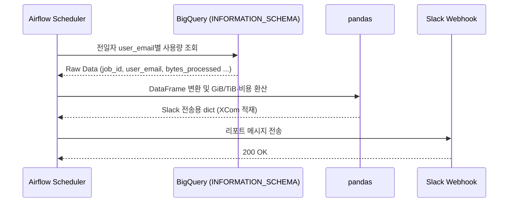

> BigQuery 비용 절감을 위해 기획했던 쿼리 비용 모니터링 및 알럿 자동화에 대해 개인적으로 정리한 글입니다.

### <i class="fas fa-magnifying-glass-dollar fa-fw"></i> **왜 필요했나**

Google의 BigQuery는 쿼리 스캔량(Bytes Scanned)을 기준으로 과금되는 종량제 시스템이다. 비효율적인 쿼리 하나가 순식간에 큰 비용으로 이어질 수 있는데, 정작 "누가 어떤 쿼리로 얼마나 스캔했는지"는 매번 콘솔에 직접 들어가서 확인해야 했다. 제일 큰 문제는 해당 내용을 다음 결제 주기가 돼서야 알아차리는 경우가 많았다.

그래서 목표를 아래와 같이 잡았다.

- 전일(Yesterday) 기준 사용량을 **user_email 단위**로 집계해서, 누가 얼마나 썼는지 바로 보이게 하기
- 매일 아침 9시 30분(KST), 사람이 직접 조회하지 않아도 자동으로 Slack에 리포트가 오게 하기
- 콘솔 접속 없이 사내 메신저에서 바로 현황을 파악할 수 있게 하기

### <i class="fas fa-layer-group fa-fw"></i> **아키텍처**

- **Orchestration** : Apache Airflow (DAG 스케줄링 및 Task 관리)
- **Language** : Python 3.x (`pandas`, `google-cloud-bigquery`)
- **Data Warehouse** : Google BigQuery (`INFORMATION_SCHEMA` 활용)
- **Notification** : Slack Incoming Webhook

여러 도메인의 GCP 프로젝트들(예: 운영/마케팅/GA4 등..)에 대해 매일 같은 흐름이 반복되는 구조다.



### <i class="fas fa-database fa-fw"></i> **핵심 쿼리: 전일 사용량 집계**

이 프로젝트의 핵심은 결국 이 쿼리 하나다. `INFORMATION_SCHEMA`를 활용해서 user_email 기준으로 그룹화하고, 전일자만 필터링한다.

```sql
SELECT
  user_email,
  COUNT(job_id) AS total_jobs,
  SUM(total_bytes_processed) AS total_bytes_processed,
  ROUND(SUM(total_bytes_processed) / POW(1024, 3), 2) AS total_gib_processed,
  ROUND(SUM(total_bytes_processed) / POW(1024, 4), 4) AS total_tib_processed,
  ROUND((SUM(total_bytes_processed) / POW(1024, 4)) * 7.5, 2) AS estimated_cost_usd
FROM
  `region-asia-northeast3`.INFORMATION_SCHEMA.JOBS_BY_PROJECT
WHERE
  DATE(creation_time, "Asia/Seoul") = DATE_SUB(CURRENT_DATE("Asia/Seoul"), INTERVAL 1 DAY)
  AND job_type = "QUERY"
  AND state = "DONE"
  AND statement_type != "SCRIPT"
GROUP BY
  user_email
ORDER BY
  total_bytes_processed DESC
```

- `INFORMATION_SCHEMA.JOBS_BY_PROJECT`는 BigQuery가 기본 제공하는 메타데이터 뷰라, 별도 로깅 인프라 없이도 프로젝트 단위 쿼리 이력을 그대로 조회할 수 있다.
- 다루는 프로젝트들이 전부 서울 리전이라 `region-asia-northeast3`로 조회했다. On-demand 분석 요율도 리전마다 달라서, 서울 기준 TiB당 $7.5로 계산했다. [GCP 공식 가격 정책](https://cloud.google.com/bigquery/pricing)에서 리전별 요율을 다시 확인하고 쓰는 게 안전하다.
- `statement_type != "SCRIPT"`는 멀티 스테이트먼트 스크립트 실행 시 부모 `SCRIPT` job에 하위 SQL문들의 사용량이 중복으로 합산되는 걸 막기 위한 조건이다.

### <i class="fas fa-robot fa-fw"></i> **Airflow DAG**

실제로 짰던 DAG 코드다. 프로젝트 ID나 오너 이메일 같은 내부 식별자는 일반화했다.

```python
import pendulum
from airflow import DAG
from airflow.providers.standard.operators.python import PythonOperator
from airflow.exceptions import AirflowFailException
from datetime import timedelta


# --------------------------------
# 1) 사용자의 함수 import
# --------------------------------
try:
    from include.utils.bq_usage_noti import (
        run_bq_report_and_notify_project_a,
        run_bq_report_and_notify_project_b,
        run_bq_report_and_notify_project_c,
    )
except Exception as e:
    raise AirflowFailException(f"Cannot import python_func from include.utils.bq_usage_noti: {e}")

try:
    from include.utils.slack_noti import (
        slack_failed_callback,
    )
except Exception as e:
    raise AirflowFailException(f"Cannot import python_func from include.utils.slack_noti: {e}")


# --------------------------------
# 2) Airflow가 실행할 얇은 래퍼
# --------------------------------
def t_run_bq_report_and_notify_project_a(**_):
    """BigQuery 사용량 데이터 조회 및 Slack 전송 - project A"""
    run_bq_report_and_notify_project_a()

def t_run_bq_report_and_notify_project_b(**_):
    """BigQuery 사용량 데이터 조회 및 Slack 전송 - project B"""
    run_bq_report_and_notify_project_b()

def t_run_bq_report_and_notify_project_c(**_):
    """BigQuery 사용량 데이터 조회 및 Slack 전송 - project C"""
    run_bq_report_and_notify_project_c()


# --------------------------------
# 3) DAG 정의
# --------------------------------
KST = pendulum.timezone("Asia/Seoul")

with DAG(
    dag_id="bq_usage_noti_dag",
    description="BigQuery 사용량 알림 DAG",
    schedule="30 09 * * *",                              # 매일 09:30 (KST)
    start_date=pendulum.datetime(2026, 8, 10, 9, 30, tz=KST),
    catchup=False,                                        
    max_active_runs=1,                                   # 이전 실행이 아직 끝나기 전에 다음 스케줄이 겹쳐 돌지 않도록 방지
    default_args={
        "owner": "data-team@company.com",                # DAG owner를 명시해야 PR 리뷰 규칙을 통과하도록 팀 컨벤션을 정해뒀다
        "retries": 3,
        "on_failure_callback": slack_failed_callback,    # 실패 시 슬랙 알림
    },
    tags=["GCP", "cost-saving", "BigQuery"],
) as dag:
    t_run_bq_report_and_notify_project_a = PythonOperator(
        task_id="t_run_bq_report_and_notify_project_a",
        python_callable=t_run_bq_report_and_notify_project_a,
    )
    t_run_bq_report_and_notify_project_b = PythonOperator(
        task_id="t_run_bq_report_and_notify_project_b",
        python_callable=t_run_bq_report_and_notify_project_b,
    )
    t_run_bq_report_and_notify_project_c = PythonOperator(
        task_id="t_run_bq_report_and_notify_project_c",
        python_callable=t_run_bq_report_and_notify_project_c,
    )

    # --------------------------------
    # 4) DAG 순서 정의
    # --------------------------------
    t_run_bq_report_and_notify_project_a >> t_run_bq_report_and_notify_project_b >> t_run_bq_report_and_notify_project_c
```

몇 가지 눈에 띄는 부분을 짚어보면,

- Airflow 3.x부터는 `PythonOperator`도 `airflow.providers.standard.operators.python`에서 가져온다. 2.x에 익숙하다면 import 경로가 바뀐 걸 헷갈리기 쉽다.
- import 단계에서부터 `try-except`로 감싸고 `AirflowFailException`을 던지게 해뒀다. 함수 하나만 잘못 옮겨져 있어도 DAG 파싱 자체가 조용히 실패하는 대신, 원인이 로그에 명확히 남는다.
- 세 프로젝트를 굳이 `>>`로 순차 실행시킨 것도 특징이다. 서로 의존관계는 없어서 병렬로 돌려도 되지만, 초기 버전이라 우선 단순하게 순차로 짜뒀다.

### <i class="fas fa-code fa-fw"></i> **주요 로직**

- **동적 날짜 계산** : Airflow의 `logical_date`와 KST 타임존을 함께 써서, 실행 시점과 무관하게 정확히 "어제" 날짜의 데이터만 타겟팅한다.
- **인증 예외 처리** : 서비스 계정 키 파일 경로(`KEY_PATH`) 오류나 인증 만료가 생겨도 파이프라인이 조용히 멈추지 않도록 `try-except`로 감싸고, 실패 원인이 로그와 슬랙 알림에 명확히 남게 했다.
- **데이터 가공** : BigQuery에서 조회한 Raw Data를 Pandas DataFrame으로 변환한 뒤, Slack 메시지 포맷에 맞는 Dictionary로 가공해서 XCom에 적재한다. Task 간 데이터 전달을 XCom 하나로 통일해두면, 이후 리포트 형식이 바뀌어도 조회 로직과 알림 로직을 서로 건드리지 않고 각자 수정할 수 있다.

### <i class="fas fa-slack fa-fw"></i> **결과물**

매일 아침 9시 30분, 프로젝트별로 이런 메시지가 온다.

{: width="1754" height="840" }
_전일 기준 BigQuery 사용량 리포트 예시_

Date/Total Cost/Data Usage/Total Jobs 요약과 함께, 사용량이 많은 순으로 유저를 정렬해서 보여준다. 콘솔에 따로 들어가지 않아도 슬랙 메시지 하나로 "어제 얼마나 썼고 누가 제일 많이 썼는지"가 바로 파악된다. 더 자세히 파고들고 싶을 때를 위해 메시지 하단에 **BigQuery Console** 버튼도 같이 붙여둬서, 클릭 한 번으로 바로 콘솔까지 넘어갈 수 있게 했다.

### <i class="fas fa-chart-line fa-fw"></i> **기대 효과**

- 매일 자신의 쿼리 사용량을 확인하게 되면서, 팀원들이 자발적으로 쿼리 효율을 신경 쓰는 문화(FinOps)가 자연스럽게 자리 잡는다.
- 평소보다 사용량이 급격히 튀면 다음 날 바로 인지하고 원인을 파악할 수 있다.
- GCP 콘솔에 직접 들어가서 결제 내역을 export하던 수동 리포팅 업무가 사라진다.

### <i class="fas fa-book fa-fw"></i> **참고 자료**

- [데이터웨어하우스 비용 최적화, BigQuery 사용량 모니터링 시스템 구축기](https://techspace.jobplanet.co.kr/%EB%8D%B0%EC%9D%B4%ED%84%B0%EC%9B%A8%EC%96%B4%ED%95%98%EC%9A%B0%EC%8A%A4%EB%B9%84%EC%9A%A9-%EC%B5%9C%EC%A0%81%ED%99%94bigquery-%EC%82%AC%EC%9A%A9%EB%9F%89%EB%AA%A8%EB%8B%88%ED%84%B0%EB%A7%81%EC%8B%9C%EC%8A%A4%ED%85%9C%EA%B5%AC%EC%B6%95%EA%B8%B0-22005)
- [Airflow Review](https://medium.com/iotrustlab/airflow-review-d849fb39f779)

### <i class="fas fa-flag-checkered fa-fw"></i> **마무리**

콘솔에 매번 들어가서 확인하던 걸 슬랙 메시지 하나로 줄인 것뿐인데, 체감되는 편의성은 생각보다 컸다. 무엇보다 "내가 어제 얼마나 썼는지"가 매일 아침 눈에 보이니, 쿼리 하나 짤 때도 스캔량을 한 번 더 생각하게 되는 효과가 은근히 큰 것 같다.
