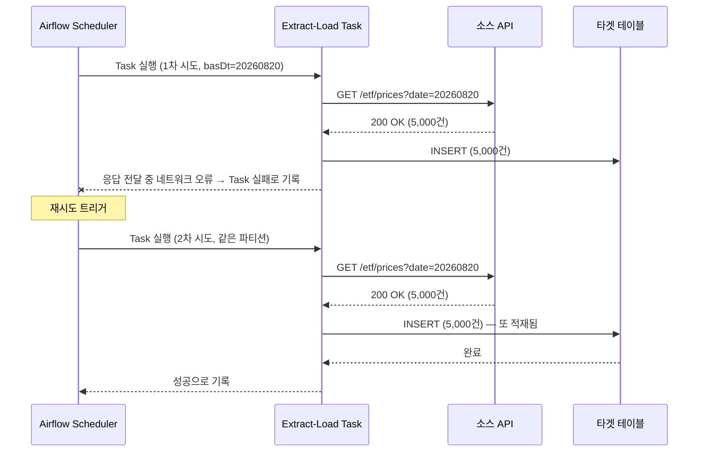
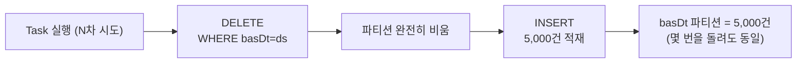

> 처음 파이프라인을 짤 때는 멱등성이라는 개념 자체를 잘 몰랐다. 그냥 "위에서 아래로 순서대로 한 번 실행되면 끝"이라고 생각하고 짰는데, 배치 중간에 에러가 나서 재시도를 걸어야 하는 순간이 오니까 그제서야 문제를 느꼈다. Airflow Task를 재시도했더니 데이터가 중복으로 쌓여버린 그 뼈저린 경험을 정리해본 글이다.

### <i class="fas fa-question fa-fw"></i> **멱등성이 뭔데**

멱등성(Idempotency)은 **같은 작업을 한 번 실행하든 열 번 실행하든, 최종 결과가 똑같아야 한다**는 성질이다. 수학적으로 표현하면 `f(x) = f(f(x))` — 함수를 한 번 적용한 것과 여러 번 적용한 것의 결과가 같다는 뜻이다.

데이터 파이프라인에 대입해보면 이렇다. `2026-08-20` 날짜 파티션을 채우는 배치 Task가 있다고 하자.

- **멱등하지 않은 경우** : 정상적으로 5,000건을 적재했는데, 그 이후 단계에서 에러가 나서 Task 전체가 재시도된다. 재시도 과정에서 같은 5,000건을 또 `INSERT`하면, `2026-08-20` 파티션에는 5,000건이 아니라 **10,000건**이 쌓인다. 세 번째 재시도까지 겹치면 15,000건이 된다.
- **멱등한 경우** : 같은 Task를 몇 번을 재시도해도, `2026-08-20` 파티션의 최종 row 수는 항상 **5,000건**으로 동일하다.

즉 데이터 엔지니어링에서 멱등성이란 "이 배치를 다시 돌려도 테이블 상태가 처음 한 번 성공했을 때와 똑같은가"를 묻는 질문이다.

### <i class="fas fa-bug fa-fw"></i> **왜 중요한가 — 직접 겪어보고 알았다**

처음 데이터 파이프라인을 짤 때는 이 개념의 중요성을 전혀 몰랐다. "정상적으로 한 번만 실행되는 상황"만 생각하고 코드를 짰다. 문제는 파이프라인이 항상 정상적으로만 도는 게 아니라는 거였다.

중간 단계에서 네트워크 타임아웃이나 일시적인 소스 API 장애로 에러가 났을 때, Airflow의 재시도(retry) 정책을 믿고 그냥 다시 돌렸다. 그런데 재시도가 Task 전체를 처음부터 다시 실행하다 보니, 이미 적재된 부분까지 한 번 더 적재되면서 같은 파티션에 데이터가 중복으로 쌓이는 문제가 생겼다. 그렇다고 "어디까지 처리됐는지"를 파악해서 그 지점부터만 다시 돌릴 수 있는 것도 아니었다 — 애초에 그런 걸 고려하고 짠 파이프라인이 아니었으니까.

에러가 난 지점부터 다시 시작하고 싶은데 그게 안 되는 상황, 그렇다고 처음부터 다시 돌리자니 이미 적재된 부분이 중복될까 봐 불안한 상황. 결국 파티션별 row 수를 하나하나 확인해가면서 중복분을 수동으로 지워야 했다. 그때 처음으로 "재시도해도 안전한 파이프라인"이 왜 중요한지 몸으로 느꼈다. 이 습관이 안 잡혀 있으면, 새벽에 배치가 실패했을 때 마음 편히 자거나 쉴 수가 없다 — 재시도 버튼을 누르는 것조차 조심스러워지기 때문이다.

### <i class="fas fa-diagram-project fa-fw"></i> **멱등성 없는 파이프라인에서 실제로 벌어지는 일**

[ETF 데이터 파이프라인]()에서 실제로 겪었던 것과 비슷한 상황을 시간 순서로 그려보면 이렇다.



데이터 적재 자체는 1차 시도에서 이미 끝났다. 다만 그 성공이 Airflow에 전달되기 전에 오류가 났을 뿐이다. 그런데 Task 입장에서는 "이 파티션에 이미 데이터가 있는지"를 확인하는 로직이 없으니, 2차 시도도 그냥 새로 적재해버린다. Task는 "재시도 끝에 성공"으로 기록되지만, 실제로는 `basDt=20260820` 파티션에 데이터가 두 배로 쌓인 상태다. 이게 멱등성 없는 파이프라인에서 재시도가 위험한 이유다 — **실패와 중복 적재를 구분할 방법이 없다.**

### <i class="fas fa-list-check fa-fw"></i> **멱등성을 보장하는 파이프라인의 특성**

에러를 겪고 나서 다시 파이프라인을 설계할 때 챙기게 된 특성들이다.

- **재시작 가능(Restartable)** : 어느 시점에서 실패하든, 처음부터든 실패 지점부터든 다시 돌렸을 때 최종 테이블 상태가 달라지지 않아야 한다.
- **명확한 실행 단위** : `basDt`(파티션 날짜), Airflow의 `execution_date`/`run_id`처럼 한 번의 실행이 정확히 어떤 데이터 범위를 대상으로 하는지가 명확해야 한다. 실행 단위가 모호하면 어디까지 다시 처리해야 할지도 알 수 없다.
- **결정론적(Deterministic) 로직** : 같은 입력이면 같은 출력이 나와야 한다. `datetime.now()`처럼 실행할 때마다 달라지는 값을 파티션 키나 적재 로직에 섞으면, 재시도할 때마다 결과가 미묘하게 달라진다.
- **부작용(Side Effect) 격리** : Slack 알림, 다운스트림 트리거처럼 "되돌릴 수 없는" 부작용은 별도로 실행 이력을 기록해서, 이미 실행됐는지 확인 후 건너뛸 수 있어야 한다.

### <i class="fas fa-toolbox fa-fw"></i> **멱등성을 보장하는 방법들**

#### <i class="fas fa-table-cells fa-fw"></i> 파티션 단위 Overwrite (Delete + Insert)

배치 파이프라인에서 가장 흔하게 쓰는 패턴이다. 적재하기 전에 해당 파티션을 통째로 지우고 다시 채운다. 이전 시도가 일부만 적재하고 실패했더라도, 재시도하면 그 잔여 데이터까지 깨끗하게 지워지고 다시 채워지기 때문에 결과가 항상 동일하다.

```python
def load_partition(ds, **context):
    # 1. 같은 날짜 파티션 먼저 삭제 (이전 시도가 일부만 적재했어도 초기화됨)
    spark.sql(f"DELETE FROM etf_price_info WHERE basDt = '{ds}'")
    # 2. 다시 적재
    df.write.mode("append").partitionBy("basDt").saveAsTable("etf_price_info")
```

재시도가 몇 번을 걸려도 흐름 자체는 항상 "완전히 비우고 → 다시 채우기"로 동일하기 때문에, 결과도 항상 같다.



#### <i class="fas fa-code-merge fa-fw"></i> UPSERT / MERGE

파티션을 통째로 지우고 다시 채우기 부담스러운 경우(테이블이 파티션 없이 하나로 크거나, 원본 대비 변경분만 반영해야 하는 경우)에는 비즈니스 키 기준으로 `MERGE`를 쓴다. 키가 같으면 값만 갱신하고, 없으면 새로 삽입하기 때문에 몇 번을 실행해도 결과가 같다.

```sql
-- 멱등하지 않음: 실행할 때마다 row가 새로 쌓인다
INSERT INTO etf_price_info (srtnCd, basDt, clpr)
VALUES ('069500', '20260820', 28500);

-- 멱등함: (srtnCd, basDt)가 같으면 값만 갱신, 없으면 새로 삽입
MERGE INTO etf_price_info AS target
USING (SELECT '069500' AS srtnCd, '20260820' AS basDt, 28500 AS clpr) AS source
ON target.srtnCd = source.srtnCd AND target.basDt = source.basDt
WHEN MATCHED THEN UPDATE SET clpr = source.clpr
WHEN NOT MATCHED THEN INSERT (srtnCd, basDt, clpr) VALUES (source.srtnCd, source.basDt, source.clpr);
```

#### <i class="fas fa-fingerprint fa-fw"></i> 이벤트 ID 기반 Dedup (스트리밍/CDC 파이프라인)

배치가 아니라 Kafka 같은 스트리밍 파이프라인이라면 접근이 조금 다르다. Consumer가 메시지를 처리한 뒤 오프셋을 커밋하기 전에 죽으면, 재시작했을 때 같은 메시지를 다시 읽어오는 건 지극히 정상적인 동작이다(At-least-once). 이때 메시지 자체에 실려 있는 고유 이벤트 ID를 기준으로, 이미 처리한 ID면 적재를 건너뛰는 방식으로 멱등성을 보장한다.

```sql
-- event_id가 PK인 dedup 테이블에 이미 존재하면 무시하고, 없으면만 적재
INSERT INTO order_events (event_id, order_id, status)
SELECT '${event_id}', '${order_id}', '${status}'
WHERE NOT EXISTS (
  SELECT 1 FROM order_events WHERE event_id = '${event_id}'
);
```

CDC(Change Data Capture)로 원본 DB의 변경분을 스트리밍으로 받아오는 파이프라인에서도 같은 원리가 적용된다. 같은 변경 이벤트가 네트워크 재전송으로 중복 도착해도, `event_id`(혹은 binlog의 LSN 같은 고유 오프셋)를 기준으로 이미 반영한 이벤트는 그냥 건너뛰면 된다.

#### <i class="fas fa-magnifying-glass fa-fw"></i> 처리 이력 테이블로 상태 체크 후 Skip

Task를 실행하기 전에 "이 실행 단위가 이미 처리된 상태인지"를 먼저 확인하고, 처리됐다면 건너뛰는 방식이다. 별도의 파이프라인 실행 이력 테이블(`pipeline_run_log` 같은)을 두고, `(dag_id, execution_date)` 조합이 이미 `SUCCESS`로 기록돼 있는지 조회한 뒤에만 실제 로직을 태운다. 파티션 Overwrite나 MERGE를 적용하기 애매한 외부 API 트리거, 알림 발송처럼 되돌릴 수 없는 부작용을 다룰 때 특히 유용하다.

네 가지를 정리하면 이렇다.

| 방법 | 적합한 상황 | 장점 | 단점 |
| --- | --- | --- | --- |
| 파티션 Overwrite | 배치가 날짜/파티션 단위로 도는 경우 | 구현이 단순하고, 항상 깨끗한 상태를 보장 | 재시도할 때마다 파티션 전체를 다시 써야 해서 시간·비용이 듦 |
| UPSERT / MERGE | 파티션이 없거나, 변경분만 반영해야 하는 큰 테이블 | 필요한 row만 갱신해서 효율적 | 비즈니스 키 설계가 필요하고, 엔진마다 MERGE 지원 여부가 다름 |
| 이벤트 ID Dedup | Kafka·CDC 같은 스트리밍 파이프라인 | At-least-once 전달과 자연스럽게 결합됨 | dedup 테이블/캐시를 별도로 관리해야 함 |
| 처리 이력 테이블 | 알림 발송, 외부 API 트리거처럼 되돌릴 수 없는 부작용 | 부작용의 중복 발생 자체를 원천 차단 | 이력 테이블 자체의 정합성도 관리 대상이 됨 |

### <i class="fas fa-scale-balanced fa-fw"></i> **결국 "정확히 한 번"이 아니라 "여러 번 실행해도 안전하게"**

분산 파이프라인에서 데이터를 정확히 한 번(Exactly-once)만 처리하도록 보장하는 건 이론적으로도 굉장히 까다롭다. 그래서 실무에서는 대부분 **최소 한 번(At-least-once) 전달 + 멱등한 적재**의 조합으로 문제를 우회한다. "같은 파티션이나 이벤트가 중복으로 처리돼도 상관없다, 어차피 최종 테이블 상태는 항상 같으니까"라는 접근이다. 완벽하게 한 번만 실행되도록 스케줄러와 씨름하기보다, 몇 번을 실행해도 결과가 안전하도록 파이프라인을 만드는 쪽이 훨씬 현실적이고 견고하다.

### <i class="fas fa-flag-checkered fa-fw"></i> **정리**

에러가 나면 재시도하는 건 너무 당연한 대응이라 별생각 없이 넘어가기 쉬운데, 그 재시도가 안전하려면 파이프라인이 처음부터 멱등하게 설계돼 있어야 한다는 걸 데이터가 중복으로 꼬이고 나서야 깨달았다. 지금은 DAG를 짤 때 "이 Task가 중간에 실패해서 재시도되면 테이블이 어떻게 될까?"를 항상 먼저 물어보는 습관이 생겼다. 결국 좋은 파이프라인은 한 번에 성공하는 파이프라인이 아니라, 몇 번을 실패하고 재시도해도 테이블 상태가 달라지지 않는 파이프라인이라고 생각한다. 그래야 새벽에 배치가 깨져도 재시도 버튼 하나 누르고 다시 마음 편히 쉴 수 있다.
