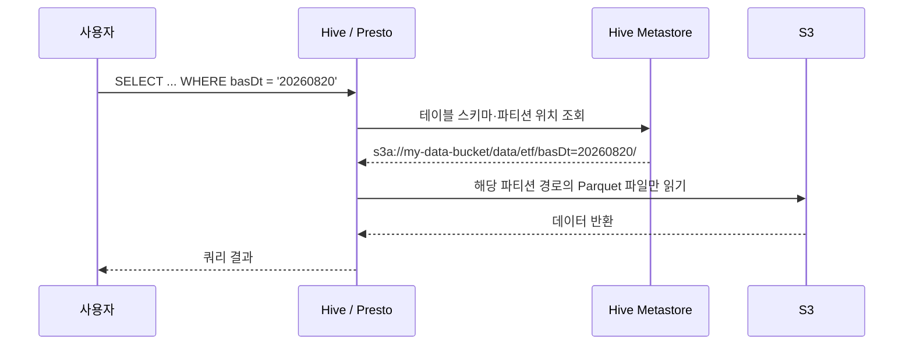

> 데이터 파이프라인을 다루다 보면 결국 한 번은 거치게 되는 곳, Amazon S3. 이게 정확히 뭐고 왜 다들 여기에 데이터를 쌓는지, 그리고 실제로 S3 위에 Hive 외부 테이블을 만들어봤던 경험까지 정리해본 글입니다.

### <i class="fas fa-box fa-fw"></i> **S3란**

S3(Simple Storage Service)는 AWS가 제공하는 **객체 스토리지(Object Storage)** 서비스다. 일반적인 파일 시스템처럼 디렉토리 안에 파일이 계층적으로 들어있는 구조가 아니라, **Bucket**이라는 공간 안에 **Key**(문자열 하나)와 **Object**(실제 데이터)가 쌍으로 저장되는 구조다.

여기서 사람들이 자주 헷갈리는 부분이 있다. S3 콘솔을 열어보면 분명 폴더처럼 보이는데, 실제로는 그런 디렉토리 구조가 존재하지 않는다.

{: width="1000" height="480" }
_S3는 폴더가 아니라, "/"가 포함된 문자열 Key를 콘솔이 폴더처럼 보여줄 뿐이다_

`data/etf/basDt=20260820/part-00000.parquet`라는 파일은, 사실 `data/etf/basDt=20260820/part-00000.parquet`라는 **이름을 가진 객체 하나**일 뿐이다. 폴더를 새로 만들거나 지우는 개념 자체가 없고, 그냥 Key 문자열이 그렇게 생겼을 뿐이다. 이 특성이 나중에 Hive 파티션과 자연스럽게 맞아떨어지는 이유이기도 하다.

### <i class="fas fa-circle-check fa-fw"></i> **왜 다들 S3를 쓰는가**

- **사실상 무제한 확장성** : 용량 계획을 미리 세울 필요 없이, 넣는 만큼 그냥 늘어난다.
- **압도적인 내구성** : 99.999999999%(11개의 9)의 내구성을 표방한다. 같은 리전 내 여러 시설에 자동으로 복제되기 때문에, 디스크 하나가 고장 나서 데이터가 사라지는 걸 걱정할 필요가 없다.
- **쓴 만큼만 과금** : 저장 용량과 요청(API 호출) 단위로 과금되고, 스토리지 클래스를 나눠서 자주 안 쓰는 데이터는 훨씬 저렴하게 보관할 수 있다.
- **생태계 통합** : Athena, Glue, EMR, Redshift Spectrum은 물론이고 Hive/Presto/Trino 같은 오픈소스 엔진들도 S3를 기본 데이터 레이크 저장소로 취급한다. "일단 S3에 넣어두면" 어떤 분석 엔진으로든 붙일 수 있다는 게 제일 큰 장점이다.

### <i class="fas fa-layer-group fa-fw"></i> **스토리지 클래스**

같은 S3라도 데이터를 얼마나 자주 꺼내 쓰느냐에 따라 스토리지 클래스를 다르게 가져갈 수 있다.

| 클래스 | 접근 빈도 | 검색(Retrieval) | 주요 용도 |
| --- | --- | --- | --- |
| S3 Standard | 자주 | 즉시 | 활발하게 조회되는 운영 데이터 |
| S3 Intelligent-Tiering | 예측 불가 | 즉시 | 접근 패턴이 일정치 않은 데이터, 자동으로 계층 이동 |
| S3 Standard-IA | 드묾 | 즉시 (검색 비용 별도) | 백업, 재해 복구용 데이터 |
| S3 Glacier Instant Retrieval | 아주 드묾 | 즉시 | 분기/연 단위로만 조회하는 아카이브 |
| S3 Glacier Deep Archive | 거의 없음 | 수 시간 | 장기 보관용 규제/컴플라이언스 데이터 |

데이터 파이프라인에서 매일 돌아가는 배치가 읽고 쓰는 데이터는 대부분 Standard에 두고, 오래된 로그나 백업본만 Lifecycle 정책으로 자동으로 IA·Glacier로 내려가게 설정해두는 패턴을 많이 쓴다.

### <i class="fas fa-database fa-fw"></i> **실전: S3 위에 Hive 외부 테이블 만들기**

실제로 S3에 쌓인 Parquet 파일들을 Hive 외부 테이블(External Table)로 매핑해서 조회해본 적이 있다. 이전에 [ETF 데이터 파이프라인 글]()에서 다뤘던 것과 비슷한 구조라고 생각하면 되는데, S3에 파티션 형태로 쌓인 Parquet 데이터를 Hive Metastore에 스키마로 등록해서, 실제 데이터는 S3에 그대로 둔 채 SQL로 바로 조회할 수 있게 하는 방식이다.

```sql
CREATE EXTERNAL TABLE IF NOT EXISTS analytics.etf_price_info (
  srtnCd  STRING,
  isinCd  STRING,
  itmsNm  STRING,
  clpr    STRING,
  fltRt   STRING
)
PARTITIONED BY (basDt STRING)
STORED AS PARQUET
LOCATION 's3a://my-data-bucket/data/etf/';

-- S3에 이미 올라와 있는 파티션 경로를 Hive Metastore에 인식시키기
MSCK REPAIR TABLE analytics.etf_price_info;
```

핵심은 `LOCATION`에 S3 경로를 지정한다는 점이다. Hive는 실제 데이터를 복사해오지 않고, 그냥 "이 경로에 있는 파일들이 이 스키마를 가진 테이블이다"라고 메타데이터만 등록한다. 그래서 데이터를 다시 옮기지 않고도, S3에 계속 쌓이는 Parquet 파일을 SQL로 즉시 조회할 수 있다.

쿼리 하나가 실행될 때의 흐름을 그려보면 이렇다.



`WHERE basDt = '20260820'` 조건 덕분에, 쿼리 엔진은 다른 날짜의 파티션은 아예 읽지 않고 해당 파티션 경로에 있는 파일들만 골라서 읽는다. S3가 Key 접두어(prefix) 기준으로 객체를 빠르게 나열할 수 있다는 특성과, Hive의 파티션 프루닝이 맞물려서 가능한 일이다.

다만 새 파티션이 S3에 추가될 때마다 `MSCK REPAIR TABLE`을 돌려줘야 Metastore가 인식한다는 점은 여전히 번거롭다. [Iceberg 도입기 글]()에서 다뤘던 것처럼, 이 부분은 Iceberg 같은 오픈 테이블 포맷으로 넘어가면 자동으로 해결되는 지점이기도 하다.

### <i class="fas fa-flag-checkered fa-fw"></i> **정리**

S3는 결국 "저렴하고, 거의 무한하고, 어떤 분석 엔진에서든 붙일 수 있는" 저장소라는 게 가장 큰 매력이다. 여기에 Parquet처럼 분석에 최적화된 포맷으로 데이터를 올려두고, Hive 외부 테이블로 스키마만 얹으면 데이터를 옮기지 않고도 바로 SQL로 다룰 수 있다. 데이터 레이크라는 개념이 결국 "S3 + 파일 포맷 + 메타데이터 카탈로그" 조합으로 수렴하는 이유가 여기에 있는 것 같다.
