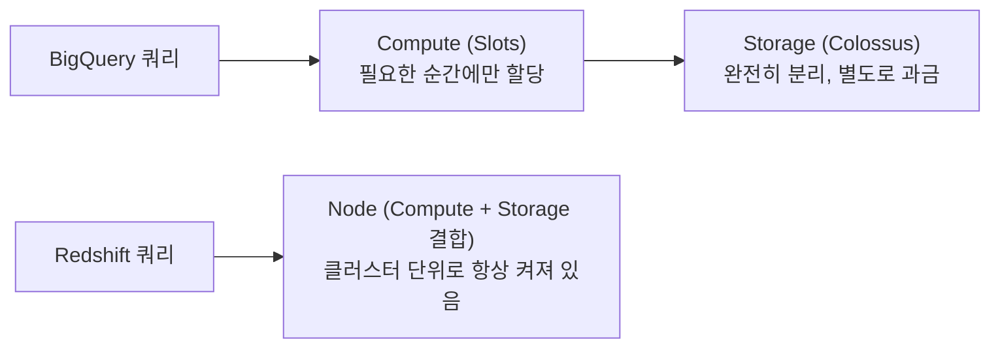

> 요즘 데이터 엔지니어 채용 공고를 보다 보면 절반 이상에 BigQuery가 등장한다. 왜 다들 BigQuery를 쓰는지, AWS의 Redshift와는 뭐가 다른지, 실제로 쓸 때는 뭘 조심해야 하는지를 정리해본 글이다.

### <i class="fas fa-question fa-fw"></i> **BigQuery가 뭔데**

BigQuery는 Google Cloud가 제공하는 **완전관리형 서버리스 데이터 웨어하우스**다. "서버리스"라는 말이 중요한데, 클러스터를 만들고 노드 개수를 정하고 스케일링 정책을 짜는 과정 자체가 아예 없다. 콘솔이나 `bq` CLI에서 SQL을 실행하면, Google이 내부적으로 컴퓨팅 자원을 알아서 할당해서 쿼리를 처리하고, 끝나면 그 자원을 반납한다.

이게 가능한 이유는 BigQuery가 **스토리지와 컴퓨트를 완전히 분리**한 아키텍처이기 때문이다. 데이터는 Colossus라는 Google 내부 분산 파일 시스템에 저장되고, 쿼리는 Dremel이라는 실행 엔진이 필요한 만큼 컴퓨팅 자원("슬롯")을 그때그때 빌려와서 처리한다. 데이터를 얼마나 쌓아뒀는지와, 쿼리를 얼마나 돌리는지가 서로 완전히 독립적으로 과금되는 것도 이 구조 때문이다.



### <i class="fas fa-arrow-trend-up fa-fw"></i> **왜 요즘 다들 BigQuery를 쓸까**

**1. 서버리스라 시작 장벽이 거의 없다**

클러스터 사이징, 노드 타입 선택, 스케일링 정책 같은 걸 고민할 필요가 없다. GCP 계정만 있으면 콘솔에서 바로 SQL을 실행할 수 있고, 데이터가 몇 GB든 몇 PB든 같은 SQL 문법으로 다룬다. 초기 스타트업이나 소규모 데이터팀 입장에서는 인프라 운영 인력 없이도 바로 분석을 시작할 수 있다는 게 크다.

**2. GA4가 BigQuery로만 데이터를 무료로 export해준다**

Google Analytics 4는 원본 이벤트 데이터를 BigQuery로 매일 무료로 export해주는 기능을 기본 제공한다. 이 기능이 다른 데이터 웨어하우스에는 없다 보니, 웹/앱에 GA4를 붙인 회사는 자연스럽게 "일단 BigQuery부터" 쓰게 되는 경우가 많다. 실제로 이커머스나 커머스 스타트업 채용 공고에 BigQuery가 자주 등장하는 이유 중 상당 부분이 여기서 온다고 본다.

**3. 대화형 분석 속도가 빠르다**

수십~수백 GB 단위 테이블을 스캔하는 Ad-hoc 쿼리도 대부분 수 초~수십 초 안에 끝난다. 분석가가 "일단 돌려보고 결과 보면서 다음 쿼리 짜는" 반복 작업을 할 때 이 응답 속도 차이가 체감이 크다.

**4. GCP 생태계와 잘 붙는다**

Looker Studio, Vertex AI, Dataform 같은 GCP 서비스들이 BigQuery를 기본 데이터 소스로 취급한다. 데이터 웨어하우스 하나만 잘 갖춰두면 대시보드부터 ML 모델 학습까지 큰 이탈 없이 이어붙일 수 있다.

### <i class="fas fa-scale-balanced fa-fw"></i> **Redshift와 뭐가 다른가**

| 항목 | BigQuery | Redshift |
| --- | --- | --- |
| 아키텍처 | Storage(Colossus)·Compute(Slots) 완전 분리 | Compute+Storage가 결합된 노드 기반 클러스터 (RA3는 스토리지 일부 분리) |
| 운영 방식 | 완전 서버리스, 클러스터 관리 불필요 | Provisioned(직접 클러스터 구성) 또는 Serverless(RPU 기반) 중 선택 |
| 과금 기준 | On-demand: 스캔한 데이터량 기준 ($6.25/TiB) 또는 Editions: 슬롯 시간 기준 | Provisioned: 노드·시간 기준, Serverless: RPU·시간 기준 |
| 스케일링 | 요청 시 슬롯이 자동으로 할당 | Provisioned은 수동/반자동, Serverless는 자동 |
| 생태계 | GCP 네이티브 (GA4, Looker, Vertex AI) | AWS 네이티브 (S3, Glue, QuickSight) |

가장 근본적인 차이는 **"뭘 기준으로 돈을 내는가"**다. BigQuery on-demand는 클러스터라는 개념 자체가 없고, 쿼리가 **얼마나 많은 데이터를 스캔했는지**에 따라 과금된다. 반면 Redshift는 Provisioned든 Serverless든 결국 **컴퓨팅 자원을 얼마나 오래 켜뒀는지**가 기준이다. 노드를 켜두면 그 시간 동안 쿼리를 한 번을 돌리든 백 번을 돌리든 비용은 똑같이 나간다.

그래서 워크로드 패턴에 따라 유불리가 갈린다. 하루 종일 쿼리가 끊임없이 들어오는 워크로드라면 Redshift처럼 자원을 미리 켜두고 정액으로 쓰는 쪽이 유리할 수 있고, 반대로 쿼리가 간헐적으로 들어오는 워크로드라면 쓴 만큼만 내는 BigQuery on-demand가 유리하다. BigQuery도 사용량이 꾸준히 많아지면 Editions(슬롯 정액제)로 넘어가서 이 트레이드오프를 다시 뒤집을 수 있다.

### <i class="fas fa-triangle-exclamation fa-fw"></i> **BigQuery를 쓸 때 주의할 점**

**1. `SELECT *`가 생각보다 훨씬 비싸다**

컬럼 기반 과금이라 "필요한 컬럼만 읽으면 저렴하다"는 원칙 자체는 좋지만, 파티션 필터 없이 전체 테이블을 스캔하는 쿼리를 무심코 돌리면 비용이 순식간에 커진다.

{: width="1000" height="420" }
_같은 테이블, 같은 결과인데 WHERE 절 하나로 스캔 비용이 약 90배 차이난다_

**2. 파티셔닝·클러스터링을 처음부터 설계해둬야 한다**

날짜 컬럼 기준 파티셔닝, 자주 필터링하는 컬럼 기준 클러스터링을 걸어두지 않으면, 위 예시처럼 매번 테이블 전체를 스캔하게 된다. 테이블을 처음 만들 때부터 어떤 컬럼으로 자주 조회할지를 고려해서 설계해야 한다. 이 주제는 [BigQuery 비용 모니터링 자동화 글]()에서 실제로 겪었던 사례를 조금 더 자세히 다뤘다.

**3. 쿼리 실행 전에 스캔량을 미리 확인할 수 있다**

BigQuery 콘솔은 쿼리를 실제로 실행하지 않고도 우측 상단에 "이 쿼리를 실행하면 몇 GB/TB를 스캔한다"는 예상치를 보여준다(Dry Run). 큰 테이블을 다루는 쿼리는 실행 버튼을 누르기 전에 이 숫자부터 확인하는 습관을 들이는 게 좋다.

```sql
-- bq CLI에서 실제 실행 없이 예상 스캔량만 확인
bq query --dry_run --use_legacy_sql=false \
  'SELECT * FROM `my_project.analytics.events` WHERE basDt = "20260822"'
```

**4. 슬롯 경합(Slot Contention)**

Editions(정액제)로 넘어간 조직이라면, 무거운 쿼리 여러 개가 동시에 몰릴 때 슬롯을 서로 기다리느라 쿼리가 평소보다 느려지는 경우가 생긴다. On-demand에서는 개별 쿼리 단위로 자원이 할당돼서 잘 느끼기 어려운 문제지만, 조직 규모가 커져서 Editions로 옮겨간 뒤에는 슬롯 사용량 모니터링이 새로운 과제가 된다.

**5. 스트리밍 삽입(Streaming Insert) 비용**

배치 적재(Load Job)는 무료지만, `insertAll` API 같은 실시간 스트리밍 삽입은 별도 과금 대상이다. 실시간성이 꼭 필요하지 않은 데이터까지 스트리밍으로 넣고 있다면, 배치 주기를 짧게 잡는 것만으로도 비용을 줄일 수 있는 경우가 많다.

### <i class="fas fa-video fa-fw"></i> **더 자세히 알고 싶다면**

여기서는 채용 공고에 자주 등장하는 이유와 Redshift와의 차이 위주로만 정리했다. 슬롯 배분 알고리즘, 쿼리 실행 계획, 내부 스토리지 포맷처럼 더 깊은 내용까지 다루는 영상을 아래에 참고로 남겨둔다.



### <i class="fas fa-flag-checkered fa-fw"></i> **정리**

BigQuery가 요즘 채용 공고에 자주 보이는 건, 단순히 유행이라기보다는 서버리스라는 진입 장벽 낮은 구조와 GA4 무료 연동 같은 생태계 요인이 겹친 결과에 가깝다고 생각한다. 다만 클러스터 관리가 없다는 게 곧 "아무렇게나 써도 괜찮다"는 뜻은 아니다. 스캔량 기준 과금 모델을 이해하지 못한 채로 쓰면 오히려 Redshift보다 비용 예측이 어려워질 수 있다. 결국 어떤 데이터 웨어하우스를 쓰든, 그 서비스가 "뭘 기준으로 돈을 받는지"를 먼저 이해하는 게 제일 중요한 것 같다.
