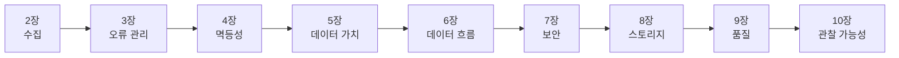

> 광화문 교보문고 데이터 코너를 구경하다 우연히 발견한 책, [데이터 엔지니어링 디자인 패턴](https://product.kyobobook.co.kr/detail/S000219084184)을 읽고 내 입맛대로 정리해보려 한다. 이번에도 장마다 한 편씩 남길 계획이고, 이번 글은 1장 "데이터 엔지니어링 디자인 패턴 소개"다.



### <i class="fas fa-book fa-fw"></i> **왜 이 책을 골랐나**

책장 구석에 꽂혀 있던 걸 제목에 끌려 꺼내 목차부터 살펴봤는데, 실무에서 실제로 겪을 법한 문제들이 패턴 단위로 촘촘하게 정리돼 있었다. 목차 구성이 마음에 들어서 그 자리에서 바로 구매했다.

### <i class="fas fa-list-check fa-fw"></i> **70가지 패턴, 10개 장으로 나뉜 목차**

책 전체는 1장 개론을 빼면 9개 장에 걸쳐 총 70개의 패턴을 다룬다.

| 장 | 제목 | 패턴 수 |
| --- | --- | --- |
| 2장 | 데이터 수집 디자인 패턴 | 8개 |
| 3장 | 오류 관리 디자인 패턴 | 7개 |
| 4장 | 멱등성 디자인 패턴 | 7개 |
| 5장 | 데이터 가치 디자인 패턴 | 10개 |
| 6장 | 데이터 흐름 디자인 패턴 | 8개 |
| 7장 | 데이터 보안 디자인 패턴 | 9개 |
| 8장 | 데이터 스토리지 디자인 패턴 | 9개 |
| 9장 | 데이터 품질 디자인 패턴 | 6개 |
| 10장 | 데이터 관찰 가능성 디자인 패턴 | 6개 |

단순히 기술별로 장을 나눈 게 아니라, 데이터가 수집되어 최종적으로 노출되기까지의 **실제 흐름 순서대로** 장이 배치돼 있다는 점이 인상적이었다.

### <i class="fas fa-diagram-project fa-fw"></i> **장 순서 자체가 데이터 파이프라인이다**

- **2장 수집** : 아키텍처에서 항상 제일 먼저 수행하는 기술 단계.
- **3장 오류 관리** : 데이터 엔지니어링의 본질적인 부분. 단순 코딩 실수일 수도 있지만, 데이터 제공자 쪽 문제인 경우도 많다.
- **4장 멱등성** : 파이프라인이 실패해서 자동이든 수동이든 재시도가 걸릴 때 필요한 패턴. 여러 번 실행해도 결과가 고유하게 유지되도록 만든다.
- **5장 데이터 가치** : 오류와 재시도를 다 처리했다면, 이제 요약·조인 같은 작업으로 비즈니스 사용자에게 실제로 의미 있는 데이터셋을 만든다.
- **6장 데이터 흐름** : 이렇게 만든 데이터셋이 조직 내 다른 데이터 구성요소와 어떻게 상호작용하는지를 정의한다.
- **7장 보안** : 데이터를 안전하게 저장하고 프라이버시 요구사항을 충족시킨다.
- **8장 스토리지** : 지연 시간을 줄이기 위해 저장 기술을 활용해 사용자 경험을 개선한다.
- **9장 품질** : 앞의 모든 걸 잘해도 품질이 무너지면 컨슈머 입장에서는 쓸모없는 데이터가 된다.
- **10장 관찰 가능성** : 모니터링 지표를 정의하고, 문제가 생길 조짐이 보이면 알람을 보내 신뢰성을 높인다.

### <i class="fas fa-star fa-fw"></i> **가장 기대되는 장 — Idempotency**

개인적으로 4장이 가장 기대된다. 과거에 직접 겪은 재시도 중복 적재 사고 때문에 [멱등성에 대한 글]()을 따로 쓴 적이 있는데, 그때는 파티션 Overwrite나 MERGE 같은 방법 몇 가지를 경험적으로 정리하는 수준이었다. 이 책은 멱등성을 아예 하나의 장으로 떼어내서 "여러 번 실행해도 고유한 결과가 생성된다"는 정의부터 패턴 7개로 체계화해뒀다고 하니, 내가 경험으로만 알고 있던 걸 이론적으로 다시 맞춰볼 좋은 기회일 것 같다.

### <i class="fas fa-triangle-exclamation fa-fw"></i> **오류는 코드 문제가 아니라 계약 문제일 수도?**

3장 소개 부분에서 크게 공감한 문장이 있었다. 오류 관리가 단순한 코딩 문제가 아니라, 데이터 제공자가 초기 계약 사항을 지키지 않고 정의되지 않은 필드로 데이터를 보내는 경우도 포함한다는 내용이었다.

> 제발 데이터 좀 처음 얘기한 대로 주자.. 마음대로 바꾸지 말고, 바꿀 거면 미리 공유 좀 해줘;
{: .prompt-warning }

파이프라인이 깨지는 원인을 내 코드에서만 찾다 보면 놓치기 쉬운 부분인데, 이 책이 이걸 오류 관리의 정식 카테고리로 다룬다는 것 자체가 반가웠다. 3장을 읽으면 이런 상황에 대응하는 패턴(데드 레터, 필터 인터셉터 등)도 구체적으로 나올 것 같다.

### <i class="fas fa-layer-group fa-fw"></i> **이 책의 강점 — 실제 사례 연구 프로젝트**

이 책은 패턴을 추상적으로 설명하고 끝내지 않고, 저자의 사례 연구 프로젝트인 **블로그 데이터 분석 플랫폼**([데이터 생성기 저장소](https://github.com/bartosz25/data-generator-blogging-platform))의 맥락 안에서 각 패턴을 소개한다고 한다. 1장에서 가장 눈에 들어온 건 이 프로젝트의 데이터 레이어 구조였는데, 메달리온 아키텍처를 따라 브론즈·실버·골드 3단으로 나뉘어 있다.

{: width="1000" height="440" }
_원시 데이터(Bronze) → 정리·강화(Silver) → 최종 사용자용 데이터(Gold) 순으로 성숙도가 올라간다_

각 패턴을 설명할 때마다 "그래서 이게 Bronze에 적용되는지, Silver에 적용되는지"를 같이 짚어줄 것 같아서, 추상적인 패턴 나열보다 훨씬 실전 감각으로 읽을 수 있을 것 같다.

### <i class="fas fa-code fa-fw"></i> **코드 예제 저장소**

책에서 언급하는 코드 예제는 [dataengineering-design-patterns-book](https://github.com/bartosz25/data-engineering-design-patterns-book) 저장소에 정리돼 있는 것 같다. 장을 읽으면서 막히는 부분이 있으면 여기 코드를 같이 참고할 생각이다.

### <i class="fas fa-flag-checkered fa-fw"></i> **정리**

1장은 책의 목차와 전체 흐름을 소개하는 역할이라 아직 구체적인 패턴은 하나도 안 나왔지만, 장 순서 자체가 데이터 파이프라인의 실제 흐름을 그대로 따라가고 있어서 앞으로 읽을 내용의 지도를 미리 받은 느낌이다. 특히 멱등성 장은 직접 사고를 겪어본 주제라 더 기대되고, 오류 관리를 "제공자 계약 문제"까지 포함해서 다룬다는 점도 마음에 들었다. 2장부터는 실제 패턴들이 하나씩 나올 텐데, 이어서 정리해볼 예정이다.
