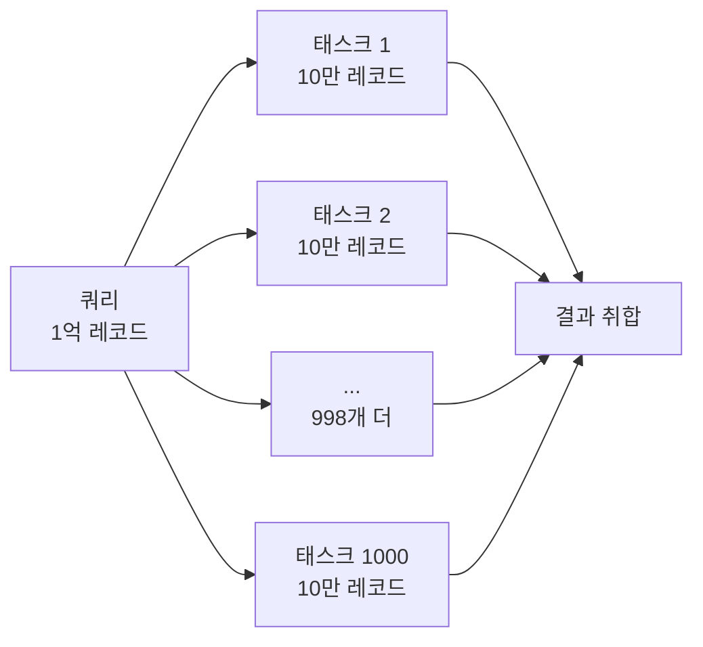

> [빅데이터를 지탱하는 기술]() 1장에 이어 2장 "빅데이터의 탐색"을 읽고 정리한다. 이번 장은 결국 "어떻게 하면 시각화를 잘할 수 있는가"에 대한 이야기였다.

### <i class="fas fa-table-cells fa-fw"></i> **크로스 집계란 뭘까**

데이터 시각화의 가장 기본이 되는 개념으로 크로스 집계부터 설명한다. 여기엔 두 종류의 테이블이 나온다.

- **트랜잭션 테이블** : 행이 계속 늘어나는 형태. 이벤트나 거래가 발생할 때마다 한 줄씩 쌓인다.
- **크로스 테이블** : 우리가 흔히 아는 스프레드시트 형식의 테이블. 행과 열 교차점에 값이 들어간다.

트랜잭션 테이블을 크로스 테이블로 바꾸는 과정이 바로 크로스 집계이고, 대표적인 예가 엑셀의 피벗 테이블 기능이다.

{: width="1000" height="420" }
_같은 데이터라도 행 위주로 쌓인 트랜잭션 테이블과, 한눈에 비교할 수 있는 크로스 테이블은 쓰임새가 다르다_

### <i class="fas fa-magnifying-glass fa-fw"></i> **룩업 테이블, 그 VLOOKUP**

다음은 룩업(lookup) 테이블 이야기다. 업무에서 많이 쓰는 VLOOKUP이 떠올라서 반가웠다. 트랜잭션 테이블은 업무 데이터베이스에서 그대로 가져오는 반면, 룩업 테이블은 분석 목적에 맞게 자유롭게 수정할 수 있어서 서로 독립적으로 관리할 수 있다는 설명이었다.

### <i class="fas fa-database fa-fw"></i> **데이터가 커지면 결국 SQL로**

BI 도구나 Pandas로 크로스 집계하는 간단한 예시가 이어지는데, 데이터가 수백만 행 단위로 커지면 이 방식은 급격히 느려진다. 그래서 자연스럽게 SQL로 먼저 집계한 다음, 그 결과만 BI 도구로 크로스 집계하는 흐름으로 넘어간다. 데이터 양에 따라 도구를 바꿔 써야 한다는 당연하지만 중요한 이야기였다.

### <i class="fas fa-scale-balanced fa-fw"></i> **데이터 마트, 크기의 트레이드오프**

집계와 시각화 사이에는 데이터 마트라는 중간 단계가 있다. 마트가 너무 작으면 시각화에서 할 수 있는 게 적어지고, 반대로 너무 크면 좋은 시각화를 만들기 어려워진다는 트레이드오프 관계로 설명한다. 딱 적당한 크기를 잡는 게 관건인 셈이다.

### <i class="fas fa-gauge-high fa-fw"></i> **마트 처리 지연을 줄이는 두 가지 방법**

데이터가 많아지면 집계가 오래 걸리고, 지연은 업무 전반에 연쇄적으로 나쁜 영향을 준다. 책에서는 이걸 줄이는 방법을 두 갈래로 소개한다.

**1. 전부 메모리에 올리기** — 메모리에 다 올릴 수 있는 데이터 양이라면 MySQL이나 PostgreSQL 같은 RDB가 데이터 마트로 적합하다. 동시 접속 성능이 좋아서 여러 명이 쓰는 운영 환경에 딱 맞는다.

**2. 압축과 분산** — 메모리가 부족해지면 얘기가 달라진다. 데이터를 최대한 압축하고 여러 디스크에 분산한 뒤, 멀티 코어로 디스크 I/O를 병렬 처리하는 아키텍처가 필요한데 이게 MPP(Massively Parallel Processing)다. BigQuery와 Redshift가 대표적인 예다. 예전엔 전문 컨설턴트를 끼고 도입하는 대형 프로젝트였다면, 클라우드 보급 덕분에 지금은 훨씬 접근하기 쉬워졌다고 한다.

MPP가 쿼리 지연을 줄이는 방식은 하나의 쿼리를 작은 태스크 여러 개로 쪼개서 병렬 처리하는 것이다. 책에 나온 예시로, 1억 레코드를 쿼리한다면 10만 레코드씩 1,000개 태스크로 나눠 병렬 처리한 뒤 마지막에 결과를 모아 집계한다.

결론적으로 마트의 지연을 줄이려면 데이터를 열 지향(컬럼형) 스토리지 형식으로 저장해야 한다는 게 이 절의 핵심이었다. 행 기반과 열 기반 DB 차이는 이미 익숙한 내용이라 가볍게 훑고 넘어갔다.

### <i class="fas fa-chart-line fa-fw"></i> **애드혹 쿼리엔 주피터, 대시보드는 오픈소스 3형제**

데이터 분석 초반엔 애드혹 쿼리를 많이 날리게 되는데, 이때 Jupyter Notebook과 matplotlib 조합이 가장 좋다고 소개한다. 이어서 오픈소스 대시보드 도구 세 가지를 비교한다.

| 도구 | 특징 |
| --- | --- |
| Redash | 파이썬 기반, SQL 쿼리 실행 결과를 그대로 시각화 |
| Superset | 파이썬 기반 대화형 도구, 화면에서 마우스 조작으로 그래프 생성 |
| Kibana | JS 기반, 실시간 대시보드에 강함. Elasticsearch(ES)의 프런트엔드라 데이터를 전부 ES에 저장해야 함 |

셋 중 Kibana는 데이터 소스를 ES 하나만 지원한다는 제약이 뚜렷해서, 쓰려면 처음부터 ES 중심으로 아키텍처를 짜야 한다는 점이 인상적이었다.

### <i class="fas fa-sitemap fa-fw"></i> **진짜 핵심 — 스타 스키마 대신 비정규화 테이블?**

개인적으로 2장에서 가장 중요하다고 생각한 부분이다. 데이터 마트를 시각화에 적합하게 설계하려면 우선 OLAP의 기본 개념을 알아야 하는데, 트랜잭션처럼 사실이 기록된 걸 **팩트 테이블**, 거기서 참조하는 마스터 데이터를 **디멘전 테이블**이라 부른다.

전통적으로는 팩트 테이블을 중심에 두고 여러 디멘전 테이블을 연결하는 **스타 스키마** 구조가 정석이었다. 이유는 두 가지다.

1. 구조가 단순해서 이해하기 쉽고 쿼리 작성이 편하다.
2. 성능 — 팩트 테이블에는 키만 남기고 나머지는 디멘전 테이블로 넘겨서, 데이터 양이 늘어나도 팩트 테이블 자체는 작게 유지해 집계 속도를 지킨다.

그런데 책은 여기서 한 걸음 더 나간다. 요즘은 MPP 데이터베이스나 열 지향 스토리지의 압축 효율이 워낙 좋아서, 굳이 디멘전 테이블로 분리하지 않고 모든 정보를 한 테이블에 합친 **비정규화 테이블** 하나만으로도 충분히 빠르다는 주장이다.

{: width="1000" height="480" }
_과거엔 팩트 테이블을 작게 유지하려고 디멘전을 분리했지만, 요즘은 압축 기술 덕분에 굳이 나누지 않아도 된다는 주장이다_

### <i class="fas fa-cube fa-fw"></i> **다차원 모델: 디멘전과 측정값**

비정규화 테이블을 준비했다면, 이걸 다차원 모델로 추상화한다. 쉽게 말하면 컬럼을 "디멘전"과 "측정값"으로 분류하는 작업이고, 이걸 기반으로 태블로 같은 도구에서 대시보드를 구성한다. 이 분류는 시각화를 하면서 나중에도 유기적으로 확장해나갈 수 있다고 한다. 이렇게 준비해두면 비정규화 테이블을 업데이트하는 것만으로 이를 참조하는 모든 대시보드가 함께 갱신되고, 워크플로 관리 도구로 마트를 정기적으로 자동 업데이트하면 일상적인 데이터 흐름까지 확인할 수 있다.

### <i class="fas fa-circle-question fa-fw"></i> **내 생각 — 비정규화 테이블 하나로 정말 충분할까**

> 2장을 다 읽고도 데이터 마트를 스타 스키마 대신 비정규화 테이블 하나로 가는 게 정말 맞나 싶은 의문이 남는다. 시간이 지나 데이터가 계속 쌓이면 대시보드 로딩 속도 이슈 같은 문제가 생기지 않을까?
{: .prompt-info }

책의 주장처럼 MPP나 열 지향 압축이 좋아진 건 사실이지만, 그렇다고 조인 비용이나 스캔량 문제가 완전히 사라지는 건 아닐 것 같다는 생각이 든다. 이 부분은 실제로 운영해보면서 검증해야 할 것 같고, 뒷장에서 이 의문에 대한 답을 좀 더 들을 수 있을지 기대된다.

### <i class="fas fa-flag-checkered fa-fw"></i> **정리**

2장은 결국 데이터를 어떻게 마트로 정제해서 시각화까지 이어붙일지에 대한 장이었다. 크로스 집계·룩업 테이블 같은 기초 개념부터, MPP로 지연을 줄이는 방법, 그리고 스타 스키마 대신 비정규화 테이블을 쓰자는 다소 과감한 주장까지 다뤘다. 이걸로 시각화를 위한 준비는 끝났고, 3장에서는 데이터 레이크를 중심으로 이야기가 이어진다고 하니 계속해서 정리해볼 예정이다.
